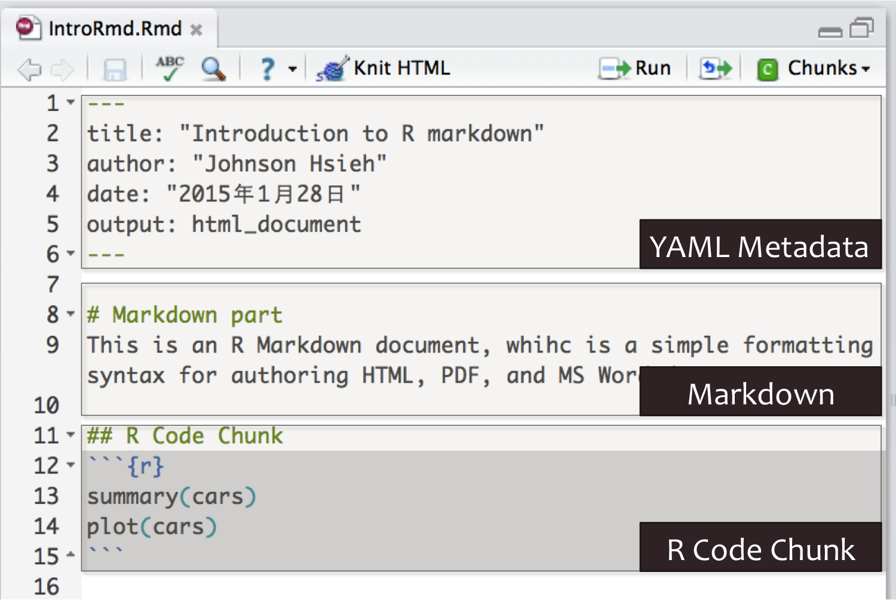
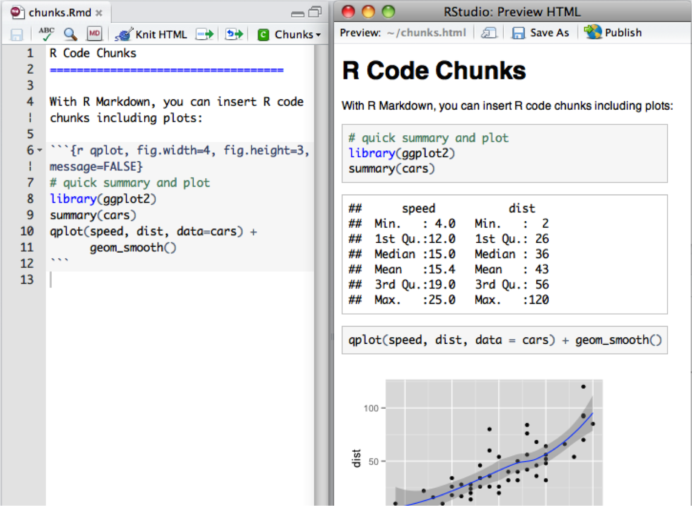
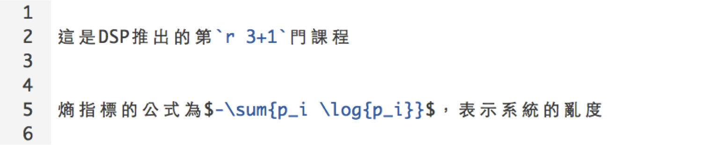
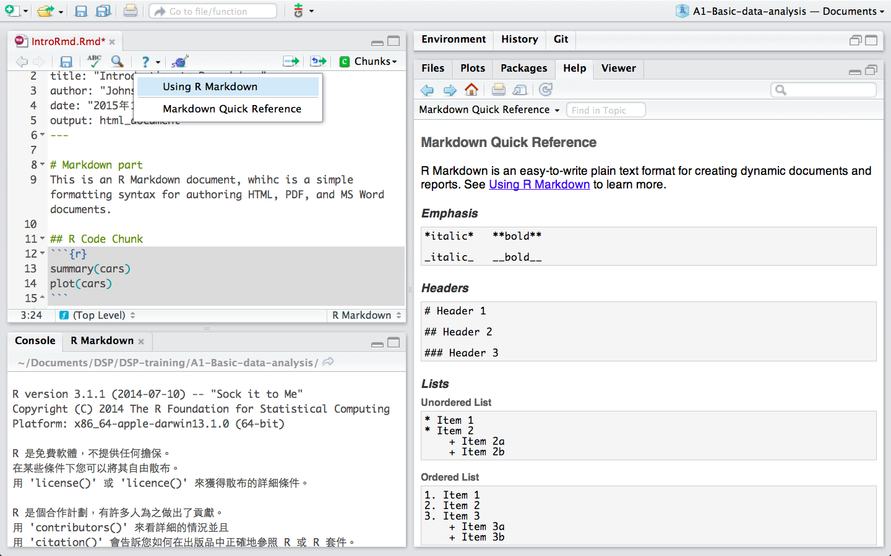
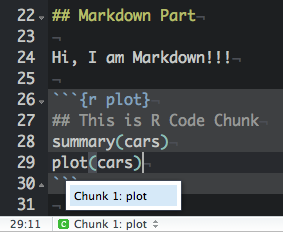

## Why you need R Markdown
<center> </img>   
  <small>http://goo.gl/rwrhpK</small> 
</center>

---
## What is R Markdown
A convenient tool to generate reproducible document.    
- [Markdown](http://daringfireball.net/projects/markdown/basics)
    - Lightweight markup language
    - Remove HTML tag for higher readibility.
    - Inline HTML is avaliable.
- R markdown
    - Markdown + embedded R code chunks
    - (.Rmd) -> (.md) -> (.html, .docx, .pdf)

---
## Why R Markdown
- 製作reproducible的報告、投影片: `document` 、 `slides`
- 想寫數學式子好展現自己的專業 $e=mc^2$:  `mathjax`
- 只有一份source code，不需要額外複製圖片到報告中: `.rmd`
- 需求更改時，可以動態改變報告內容: `integrated shiny`
- 增加資料分析演算法的可讀性: `code and text`
- HTML的報告和投影片的格式方便瀏覽: `html`
- IDE? RStudio提供支援: `Knit Button`

---
## Installation
- 最新版的RStudio已經包含R Markdown功能
- 你也可以透過以下指令安裝R Markdown套件：

```r
install.packages("rmarkdown")
```


--- .segue .dark
## R Markdown 快速導覽

---
## Overview
<center>
</img> 
</center>

---
## Markdown
<center>
</img>  
</center>

---
## R Code Chunks
<center>
</img>  
</center>

---
## Inline R Code and Equations
- 利用 \`r\` 在markdown中插入R程式
- 插入 LaTeX 公式的方法：   
    * 行內`$ equation $`   
    * 段落 `$$ equation $$`

</img>  

- 這是DSP推出的第 4門課程
- 熵指標的公式為 $-\sum{p_i \log{p_i}}$，表示系統的亂度


---
## Rendering Output
- RStudio: "Knit" command (Ctrl+Shift+K)
- Command line: rmarkdown::render function

```r
rmarkdown::render("input.Rmd")
```

--- .segue .dark
## Markdown Basics

---
## Markdown Quick Reference
在RStudio中，在UI界面中點選`help (?)`可以查閱Markdown語法   
<center>
</img>  
</center>

--- .segue .dark
## R Code Chunks

---
## Overview
R code will be evaluated and printed

<pre class="markdown"><code>&#96;&#96;&#96;{r}
summary(cars$dist)
&#96;&#96;&#96;
</code></pre>


```r
summary(cars$dist)
```

```
   Min. 1st Qu.  Median    Mean 3rd Qu.    Max. 
   2.00   26.00   36.00   42.98   56.00  120.00 
```

---
## Named R code chunk. 

<pre class="markdown"><code>&#96;&#96;&#96;{r plot}
summary(cars)
plot(cars)
&#96;&#96;&#96;
</code></pre>

- Easy Navigation in RStudio  

    

---
## Basic Chunk Options

- `echo`(TRUE): whether to include R source code in the output file  
- `eval`(TRUE): whether to evaluate the code chunk  
- `message`(TRUE): whether to preserve messages emitted by message()  
- `include`(TRUE): whether to be written into the output document, but the code is still evaluated and plot files are generated  
- `warning`(TRUE): whether to preserve warnings in the output 
- `comment`("##"): set to comment notation 
- `results`('hide','asis'): hide output ; asis treats the output of your R code as literal Markdown (when using like kable function)

Set global chunk options at code chunks header:

```r
knitr::opts_chunk$set(echo=FALSE, results='hide')
```

---
## Exercise
利用R Markdown 製作《一周天氣預報》書面報告。
- [原始出處](http://www.cwb.gov.tw/V7/forecast/taiwan/Taipei_City.htm)
- [參考範本](https://github.com/dspim/a1-basic-data-analysis-course/blob/master/RmdExQue.Rmd)
- [範例資料](https://github.com/dspim/a1-basic-data-analysis-course/blob/master/data/weather-utf8.csv)

---
## Exercise Q1
利用R Markdown 製作《一周天氣預報》書面報告。
- 計算01/28日當日的最高溫與最低溫度

```r
# Hint：
# 1. 下載weather-utf8.csv到自己的電腦上
# 2. 在R chunk中，利用read.csv()讀取檔案進行分析
  #  Windows: read.csv(,fileEncoding="UTF-8")
# 3. 找出01/28當日最高溫 max()
# 4. 找出01/28當日最低溫 min()
# 5. use inline R chunk `r max(...)` 
```

---
## Exercise A1
利用R Markdown 製作《一周天氣預報》書面報告。
- 計算01/28日當日的最高溫與最低溫度

```r
# Hint for Linu& Mac：
dat <- read.csv("data/weather-utf8.csv") 
max(dat[1:2, 4:5])
min(dat[1:2, 4:5])
# 預測高溫約`r max(dat[1:2,4:5])`度，低溫約`r min(dat[1:2,4:5])`度
```


```r
# Hint for Windows：
dat <- read.csv("data/weather-utf8.csv", fileEncoding="UTF-8") 
max(dat[1:2, 4:5])
min(dat[1:2, 4:5])
# 預測高溫約`r max(dat[1:2,4:5])`度，低溫約`r min(dat[1:2,4:5])`度
```


---
## Table Output

Set `results='asis'` to write raw results from R into the output document
- `knitr::kable`

    <pre class="markdown"><code>&#96;&#96;&#96;{r, results='asis'}
    knitr::kable(women)
    &#96;&#96;&#96;
    </code></pre>


| height| weight|
|------:|------:|
|     58|    115|
|     59|    117|
|     60|    120|
|     61|    123|
|     62|    126|
|     63|    129|


---
## Exercise Q2
利用R Markdown 製作《一周天氣預報》書面報告。
- 製作未來七天天氣預報表

```r
# Hint：
# 你可能需要dplyr套件
# 可以先用filter把白天、晚上分開處理
# 利用 paste(低溫,高溫,sep="-") 來製作溫度區間, i.e. 16-17
# 利用colnames, rownames來對整理好的資料表的行與列命名
```

---
## Exercise A2
利用R Markdown 製作《一周天氣預報》書面報告。
- 製作未來七天天氣預報表

```r
library(dplyr)
day1 <- filter(dat, 早晚=="白天")
day2 <- mutate(day1, 溫度=paste(高溫,低溫,sep="-"))
day3 <- select(day2, 天氣, 溫度)

night1 <- filter(dat, 早晚=="晚上")
night2 <- mutate(night1, 溫度=paste(高溫,低溫,sep="-"))
night3 <- select(night2, 天氣, 溫度)

out <- data.frame(t(bind_cols(day3, night3)))
colnames(out) <- day1$日期
rownames(out) <- c("白天天氣","白天溫度","晚上天氣","晚上溫度")
```

---
## Exercise A2 (conti.)
利用R Markdown 製作《一周天氣預報》書面報告。
- 製作未來七天天氣預報表

<pre class="prettyprint lang-r"><code>&#96;&#96;&#96;{r results='asis', echo=FALSE}
knitr::kable(out)
&#96;&#96;&#96;</code></pre>

---
## Exercise Q3
利用R Markdown 製作《一周天氣預報》書面報告。
- 製作未來七天天氣預報圖

```r
# Hint：
# 你可能需要ggplot2套件
# Mac顯示中文需設置字型
  # http://equation85.github.io/blog/graph-font-of-r-in-mac-os-x/
  # par(family='STHeiti')
```

---
## Exercise A3
利用R Markdown 製作《一周天氣預報》書面報告。
- 製作未來七天天氣預報圖

```r
library(ggplot2);library(reshape2)
dat1 <- mutate(dat, 時間=paste(日期,早晚,sep="\n"))
dat2 <- select(dat1, 時間, 高溫, 低溫)
colnames(dat2)[1] <- "時間" # for Windows user
dat3 <- melt(dat2)
g <- ggplot(dat3, aes(x=時間, y=value, group=variable, colour=variable)) + 
  geom_line() + 
  labs(x="時間", y="溫度") 
```

```r
# 顯示中文字 Mac user only
g + theme_gray(base_family="STHeiti") 
```


---
## Exercise
利用R Markdown 製作《一周天氣預報》書面報告。
- [原始出處](http://www.cwb.gov.tw/V7/forecast/taiwan/Taipei_City.htm)
- [參考範本](https://github.com/dspim/a1-basic-data-analysis-course/blob/master/RmdExQue.Rmd)
- [範例資料](https://github.com/dspim/a1-basic-data-analysis-course/blob/master/data/weather-utf8.csv)
- [參考解答](https://github.com/dspim/a1-basic-data-analysis-course/blob/master/RmdExAns.Rmd)

--- .segue .dark
## Appendiex

---
## About Document Content
You can add R Markdown and HTML in the YAML content.
<pre class="prettyprint lang-yaml"><code>
---
title: "Introduction to R Markdown"
author: "Wush Wu, Johnson Hsieh, George Chao"
date: "2015-04-12"
output: html_document
---
</code></pre>

---
## Some Useful HTML
- [iframe](http://www.w3schools.com/tags/tag_iframe.asp): displaying a web page within a web page
```html
<iframe src="http://twconf.data-sci.org/" height=600 width=800></iframe>
```

- [img](http://www.w3schools.com/tags/tag_img.asp): inserting images into an HTML document.
    
    Much easier for adjusting width and height.
```html

```


---
## Interactive Documents
It’s possible to embed a Shiny application within a document.

<div class="columns-2">
  
  
</div>

--- 
## 更豐富互動視覺化工具套件 shiny
<center>
</img>   
<small>https://dsp.im/events/a2-advanced-data-analysis-course/</small>
</center>

--- 
## References

- [R Markdown Cheat Sheet](http://shiny.rstudio.com/articles/rm-cheatsheet.html)
- [R Markdown](http://rmarkdown.rstudio.com/)
- [knitr](http://yihui.name/knitr/)
- [RStudio Documentation](https://support.rstudio.com/hc/en-us/categories/200035113-Documentation)
- [Reproducible Research](https://www.coursera.org/course/repdata)
- [Shiny Articles](http://shiny.rstudio.com/articles/)

